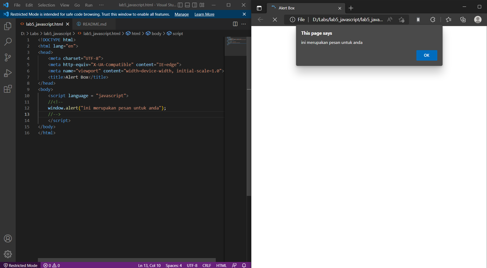

# lab5_javascript
## Pengenalan JavaScript
contoh document.write dan console.log
ini adalah tampilannya

## Javascript Dasar
pemakaian Alert sebagai property window
ini adalah tampilannya 

## Pemakaian method dalam objek
ini adalah tampilannya

## Pemakain Prompt
ini adalah tampilannya

## Pembuatan fungsi dan cara pemanggilannya
ini adalah tampilannya

## Operasi Dasar Aritmatika
ini adalah tampilannya

## Seleksi Kondisi ( if ... else)
ini adalah tampilannya

## Penggunaan operator switch untuk seleksi kondisi
ini adalah tampilannya

## Pembuatan Form
ini adalah tampilannya

## Form Button
ini adalah tampilannya

## HTML DOM
pilihan menggunakan checkBox dengan perhitungan otomatis
ini adalah tampilannya

